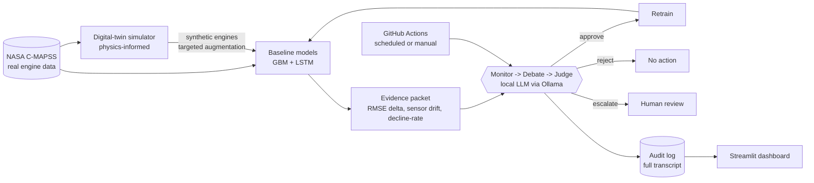
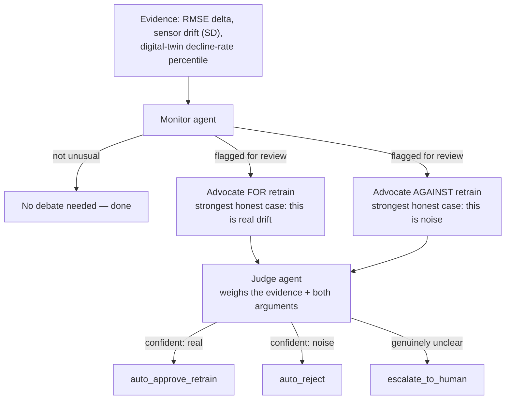

# Guardian

**A predictive-maintenance system that governs itself.** Guardian doesn't
just predict when a jet engine will fail — it watches its own model's
accuracy over time, argues with itself about whether a change in
performance is genuine drift or just noise, and only retrains when it's
actually confident that's the right call. Every one of those decisions is
made by small, open-weight language models running entirely on the machine
that trained them: nothing about the sensor data, the model's predictions,
or the reasoning behind a retrain decision ever leaves the building.

## Why this exists

Two things are usually missing from "the AI system monitors itself and
retrains automatically" pitches: **data sovereignty** and **auditability**.

- **Data sovereignty.** Sending production sensor data — or even summary
  statistics derived from it — to a third-party LLM API is a non-starter
  for a lot of industrial and safety-adjacent employers, especially in the
  EU. Guardian's entire reasoning layer runs on [Ollama](https://ollama.com)
  with small open-weight models (`llama3.2:3b` by default, configurable).
  No API keys, no outbound calls, nothing to explain to a security team —
  and this holds even in CI/CD, where the pipeline installs Ollama fresh on
  the runner rather than reaching for a cloud LLM API out of convenience.
- **Auditability.** A system that silently retrains itself on a schedule is
  a liability, not a feature, in any regulated or safety-critical context —
  and this project's dataset is literally jet-engine degradation data.
  Guardian never makes that call silently. Every retrain decision comes out
  of an actual argument between two agents and a verdict from a third, and
  the **full transcript** — not just the final answer — is logged and
  readable by anyone who wants to know why the system did what it did.

## Architecture



Real NASA turbofan data trains the baseline models; the digital-twin
simulator (Phase 2) addresses the rare-failure class imbalance visible in
that data by generating physically-plausible synthetic degradation
trajectories. Every prediction batch becomes an evidence packet the agent
layer (Phase 3) reasons over, and every decision — whatever it is — is
logged and surfaced on a dashboard (Phase 4), with the whole pipeline
runnable on a schedule or a trigger via CI/CD.

## How the debate mechanism works

This is the part of Guardian that's actually novel, so it's worth walking
through on its own:



1. **Monitor** looks at a batch of evidence — retrospective RMSE against a
   calibrated baseline, live sensor drift, and a "digital-twin comparison"
   that reuses Phase 2's simulator to say how this batch's implied
   degradation rate compares to 100 real calibration engines — and decides
   whether it's even worth a closer look. Most batches shouldn't be
   flagged; that's the point of having a monitor at all, rather than
   litigating every single update.
2. If flagged, two more agents each get the **same** evidence and build the
   strongest *honest* case they can for opposite conclusions —
   **Advocate-for-retrain** argues this is genuine drift, **Advocate-
   against-retrain** argues it's noise. Neither is allowed to invent
   evidence it wasn't given.
3. **Judge** reads the evidence and both arguments and picks one of three
   outcomes — not two. `auto_approve_retrain` and `auto_reject` are the
   confident calls; `escalate_to_human` is what happens when the evidence
   is genuinely mixed, and it's treated as a **legitimate, safe outcome**,
   not a failure to decide. A system that always forces a confident-
   sounding answer is worse than one that knows when to ask for help.
4. Every step of this — not just the verdict — is written to
   `logs/agent_decisions.jsonl` and viewable in full, transcript and all,
   in the dashboard. If a parser can't make sense of a model's output, the
   code fails toward caution by construction (flag for review; escalate to
   human) rather than silently defaulting to an auto-approve or
   auto-reject it can't actually verify.

This was tested against three scenarios with known ground truth (`noise`,
`genuine_drift`, `ambiguous`, generated from the Phase 2 simulator) — see
[`notebooks/03_agent_debate.ipynb`](notebooks/03_agent_debate.ipynb) for
the full transcripts and an honest discussion of a case where the small
local model landed on a cautious `escalate_to_human` rather than the
clean auto-approve a bigger model might have been more confident about.

## Project status

All five phases of the original build plan are implemented: data &
baseline ML, digital-twin augmentation, the debate/judge agent layer,
containerized services + CI/CD + dashboard, and this polish pass. See
[DEMO.md](DEMO.md) for a ~10-minute interview walkthrough, or the
phase-by-phase sections below for the full technical detail on any one
part.

## Phase 1 status

- Dataset: NASA C-MAPSS turbofan degradation simulation, subsets **FD001**
  (1 operating condition, 1 fault mode — the clean case) and **FD004**
  (6 operating conditions, 2 fault modes — the hard case). See
  [`data/DATA.md`](data/DATA.md) for provenance and format.
- Baseline models: a per-cycle LightGBM regressor and a sliding-window LSTM,
  both predicting Remaining Useful Life (RUL). See
  [`notebooks/01_eda.ipynb`](notebooks/01_eda.ipynb) for the EDA and, in
  particular, for how it documents the **class imbalance in the failure
  signal** — fewer than 1 in 10 cycles represent an engine actually close to
  failure. That imbalance is the problem Phase 2's digital-twin simulator
  exists to address.
- Experiment tracking: MLflow, entirely local (SQLite backend, no server).

## Phase 2 status

- **Digital-twin degradation simulator** (`src/guardian/simulator/`): fits
  a physics-informed model from real FD001 data — a shared exponential
  degradation curve per sensor, a per-engine latent "decline rate" driving
  all sensors together, per-sensor manufacturing offsets, and calibrated
  noise — then samples entirely new synthetic run-to-failure engine
  trajectories from it, optionally biased toward fast-failing engines to
  directly target the rare imminent-failure class. See
  [`notebooks/02_simulator_and_augmentation.ipynb`](notebooks/02_simulator_and_augmentation.ipynb)
  for the design writeup, plausibility-check plots (real vs. synthetic
  trajectories, lifetime distributions), and the full before/after
  evaluation.
- **Augmentation result is genuinely mixed, not a blanket win**, and a
  validation-driven sweep (`scripts/sweep_augmentation.py`, grid over
  `n_engines` × `short_life_quantile`, selecting by validation fold —
  test set never touched) confirmed it wasn't just bad luck on the first
  two hand-picked configs:
  - **GBM: no config in the swept grid beat the no-augmentation baseline.**
    This simulator's synthetic data doesn't help GBM at any intensity or
    life-skew tried.
  - **LSTM: a real, tunable win.** Test RMSE drops 29% (22.3 → 15.8) with
    the sweep-selected config — enough to beat the GBM baseline outright.
    Imminent-failure recall is a separate story: it's a high-variance
    metric on this test set (only 16 positive examples total), and the
    RMSE-optimal config doesn't also win on recall — see the notebook for
    the full tradeoff and why recall/precision shouldn't be the primary
    tuning signal at this sample size.
  - Full writeup, sweep plots, and the honest discussion of both findings:
    [`notebooks/02_simulator_and_augmentation.ipynb`](notebooks/02_simulator_and_augmentation.ipynb).
- Run it: `python scripts/generate_synthetic_data.py` (plausibility plots),
  `python scripts/sweep_augmentation.py --model gbm|lstm` (the sweep), and
  `python scripts/train.py --config configs/lstm_fd001_aug_tuned.yaml` (or
  any `*_aug_*.yaml` config) for a training run with augmentation.

## Phase 3 status

- **Four local-LLM agent roles** (`src/guardian/agents/`), each its own
  prompt and its own model call — no mega-prompt: **Monitor** decides
  whether a batch of evidence is worth a closer look at all; if flagged,
  **Advocate-for-retrain** and **Advocate-against-retrain** each build the
  strongest honest case they can; **Judge** reviews both and outputs
  `auto_approve_retrain`, `auto_reject`, or `escalate_to_human`. Every
  step — not just the final verdict — is logged to
  `logs/agent_decisions.jsonl` (gitignored, regenerated by running the
  pipeline) as the audit trail Phase 4's dashboard will read from.
- **Runs entirely on `llama3.2:3b` via a local Ollama server** — no cloud
  LLM calls anywhere. Orchestration is plain sequential Python
  (`src/guardian/agents/debate.py`), not a graph framework: this pipeline
  is linear (monitor → maybe debate → judge), so a framework's main
  value-add (state machines, retries) isn't needed yet, and every step is
  a function you can read top to bottom.
- **Fail-safe by construction, not just by prompting**: if the Monitor's
  JSON can't be parsed, the code defaults to flagging for review anyway
  (never silently skips a debate); if the Judge's JSON is unparseable or
  names an invalid decision, the code defaults to `escalate_to_human` —
  never to an auto-approve/auto-reject it can't verify. See
  `run_debate()` in
  [`src/guardian/agents/debate.py`](src/guardian/agents/debate.py).
- **Real finding while building the evidence layer**: GBM's RMSE can be a
  *misleading* drift signal — tree models can't extrapolate past their
  training range, so an out-of-distribution sensor value can collapse into
  a stable (or even better-looking) prediction rather than an obviously
  bad one. Confirmed directly (a 4 SD sensor shift *improved* RMSE by 20%+
  versus baseline) and now surfaced as an explicit caveat in the evidence
  text whenever it applies (`Evidence.rmse_may_be_misleading`), so the
  agents are told not to trust RMSE alone in that case.
- **Three scenarios with known ground truth**, generated from the Phase 2
  simulator: `noise` (calibrated, unperturbed), `genuine_drift` (faster
  decline rate + a sensor shift outside the simulator's fitted family),
  `ambiguous` (small batch, modest shift). Outcomes and an honest
  discussion of the one that landed on `escalate_to_human` rather than a
  clean auto-approve: see
  [`notebooks/03_agent_debate.ipynb`](notebooks/03_agent_debate.ipynb).
- **Model choice was a hardware-driven tradeoff, documented as such**: the
  brief suggested Llama 3.1 8B or Qwen 2.5 7B; `qwen2.5:7b-instruct` is
  pulled and available, but this machine has 8GB RAM and was measured at
  ~1 token/sec on it (swapping) versus ~20 tokens/sec on `llama3.2:3b`.
  The model is a one-line change (`--model` flag or
  `ollama_client.DEFAULT_MODEL`) for anyone running this on a machine with
  more headroom.
- Run it:
  ```bash
  ollama pull llama3.2:3b   # if not already present
  ollama serve              # if not already running
  python scripts/run_agent_pipeline.py --scenario all
  ```

## Phase 4 status

- **Three containerized services** (`docker-compose.yml`), one shared
  `Dockerfile` (they all need the same heavy scientific-Python base anyway,
  since the agent service retrains a GBM baseline in-process to build
  evidence — splitting into separate images would just duplicate that
  weight):
  - `ml` — FastAPI wrapper around the training pipeline: `GET /health`
    (latest metrics per run, straight from MLflow — the dashboard's data
    source too) and `POST /retrain` (shells out to `scripts/train.py`,
    the same path a human would run from the CLI).
  - `agent` — FastAPI wrapper around the debate pipeline: `POST /run`
    (runs monitor → maybe debate → judge on a named scenario, logs it, and
    — only if `auto_execute: true` **and** the Judge actually approved —
    calls the `ml` service's `/retrain` over plain HTTP) and
    `GET /decisions` (the audit trail, most recent first).
  - `dashboard` — the Streamlit app described below.
  - **Ollama itself is deliberately not containerized.** Its model weights
    are large and Docker on macOS can't pass through Metal GPU
    acceleration, so it runs as a normal host process; the `agent`
    container reaches it via `OLLAMA_HOST=http://host.docker.internal:11434`
    (works on Docker Desktop out of the box; `extra_hosts` in the compose
    file adds the same alias on Linux).
  - Run it: `touch mlflow.db && mkdir -p logs checkpoints outputs && docker compose up --build`,
    then `ml` on :8001, `agent` on :8002, dashboard on :8501.
- **Streamlit dashboard** (`src/guardian/dashboard/app.py`) — two tabs:
  "Model health" (a chart + table of MLflow metrics across every logged
  training run, filterable by run and metric) and "Agent decisions & audit
  trail" (every logged decision as a sortable table, plus a full-transcript
  view — the evidence text, both advocate arguments, and the Judge's
  verdict + rationale, reconstructed straight from the JSONL audit log —
  for any decision you select). Run standalone:
  `streamlit run src/guardian/dashboard/app.py`.
- **CI/CD runs the real agent pipeline, not a mock**
  (`.github/workflows/guardian-pipeline.yml`): on a weekly schedule or a
  manual trigger (with a `scenario` input — pick `noise`, `genuine_drift`,
  or `ambiguous` to simulate different "new data" batches), the workflow
  installs Ollama fresh on the GitHub-hosted runner, pulls `llama3.2:3b`,
  and runs the actual monitor → debate → judge pipeline there — still zero
  cloud LLM API calls, just a different (ephemeral) machine than a laptop.
  Retraining (`scripts/train.py`) only runs if the Judge's decision was
  `auto_approve_retrain`; an `escalate_to_human` decision surfaces as a
  workflow warning rather than silently doing nothing. The full decision
  (evidence + transcript) is written to the Job Summary and uploaded as a
  build artifact either way.

## Phase 5 status

- **This README** — the architecture diagram, the plain-language "how the
  debate mechanism works" walkthrough, and the data-sovereignty +
  auditability framing above are Phase 5's polish deliverable. The
  phase-by-phase sections below it are the detailed build log, kept as-is
  rather than deleted, since they're the actual evidence for every claim
  made above them.
- **[DEMO.md](DEMO.md)** — the interview walkthrough script: timed steps,
  what to say, exact commands, and a fallback plan if a live LLM call is
  slow or flaky on the day.

## Setup

```bash
python3 -m venv .venv
source .venv/bin/activate
pip install -e ".[dev]"
python scripts/download_data.py
```

## Training a baseline

```bash
python scripts/train.py --config configs/gbm_fd001.yaml
python scripts/train.py --config configs/lstm_fd004.yaml
```

Each run trains on the subset's training trajectories, validates on a
held-out slice of *whole engines* (never individual cycles — see
[`src/guardian/data/split.py`](src/guardian/data/split.py)), evaluates on the
official test set against the true RUL values NASA provides, and logs
params/metrics/plots/the model checkpoint to MLflow.

To inspect results:

```bash
mlflow ui --backend-store-uri sqlite:///mlflow.db
```

Metrics logged per run: RMSE, MAE, the PHM08 challenge's asymmetric scoring
function (penalizes overestimating remaining life — the dangerous direction
— more than underestimating it), and precision/recall/F1 on the
"imminent failure" class (RUL ≤ 20 cycles) — the metric that actually
reflects the rare-event detection problem, as opposed to overall regression
error. See [`src/guardian/eval/metrics.py`](src/guardian/eval/metrics.py).

## Design decisions worth knowing about

- **Training RUL labels are clipped at 125 cycles** (piecewise-linear
  degradation assumption from Heimes 2008): early in an engine's life, RUL
  isn't predictable from sensor readings, so training against the raw
  unbounded value adds noise rather than signal. Evaluation always compares
  against NASA's true (unclipped) test RUL — the clip is a training-only
  trick. See [`src/guardian/data/labeling.py`](src/guardian/data/labeling.py).
- **FD002/FD004 sensors are z-scored within their operating regime**, not
  globally. These subsets cycle through six discrete operating conditions
  that dominate a sensor's raw value far more than degradation does; without
  this step, a model mostly learns "which regime is this" rather than "how
  degraded is this engine." Regime clustering and normalization stats are
  fit on train and reused on test — never re-fit per split. See
  [`src/guardian/data/regimes.py`](src/guardian/data/regimes.py).
- **FD001/FD003 features are z-scored too** (using train statistics), even
  though tree models don't need it, because the LSTM does — unscaled
  sensor inputs (temperatures in the hundreds, ratios near 1) made it
  collapse to near-constant predictions during development. See
  [`src/guardian/data/features.py`](src/guardian/data/features.py).
- **LightGBM and PyTorch's MPS backend cannot be active in the same process**
  on this machine (macOS) — importing both and running real computation from
  each causes a native segfault. `scripts/train.py` imports each model
  library lazily, inside its own branch, so a single run only ever loads one.
- **MLflow's background telemetry thread is disabled** via
  `MLFLOW_DISABLE_TELEMETRY=true`, set before MLflow is imported. Consistent
  with this project's no-data-leaves-the-machine principle, and it also
  happened to race with the MPS backend and crash training.
- **The simulator's per-cycle noise is estimated from consecutive-cycle
  differences of the curve-fit residual, not the raw residual.** The raw
  residual also carries low-frequency curve-misfit (one shared decline-rate
  can't perfectly track every sensor), which overstated noise and made
  early synthetic trajectories visibly fuzzier than real ones on inspection.
  First-differencing cancels the slow-varying part and isolates the true
  high-frequency noise. See
  [`src/guardian/simulator/engine_simulator.py`](src/guardian/simulator/engine_simulator.py).
- **Synthetic engines are added only to the training fold, never
  validation.** Fitting the simulator on validation-fold engines would leak
  their characteristics into the sampled population, and keeping val purely
  real keeps augmented-run metrics directly comparable to the baseline run.
  See `augment_fit_split()` in
  [`scripts/train.py`](scripts/train.py).
- **Phase 3's "historical baseline" is computed from fresh unperturbed
  simulator draws, not from real validation data.** GBM has a measured
  real-vs-synthetic performance gap (see Phase 2 above); comparing a
  simulator-drawn evidence batch against a real-data baseline would make
  every scenario — including deliberately unperturbed "noise" batches —
  look like drift purely from that gap. Comparing simulator-drawn batches
  against a simulator-drawn baseline isolates the one thing actually being
  tested: whether a given batch was perturbed. See `build_context()` in
  [`src/guardian/agents/scenarios.py`](src/guardian/agents/scenarios.py).
- **Tests and services rely on `PYTHONPATH`/`sys.path`, not the editable
  install alone.** `pip install -e .` succeeds and works within the same
  shell it was run in, but its `.pth`-based path injection was observed to
  not reliably survive into a fresh shell/process on this machine — a
  real, reproducible quirk of this environment, not a one-off fluke.
  Rather than debug pip/setuptools internals further, `tests/conftest.py`
  and every service/script that needs `guardian` importable add `src/` to
  the path explicitly (and the Dockerfile sets `PYTHONPATH=/app/src`),
  which works regardless of whether the editable install's own mechanism
  does.
- **The Docker image installs PyTorch from its CPU-only index
  (`download.pytorch.org/whl/cpu`) before the rest of the package.** None
  of the three services use a GPU — containers can't reach macOS's Metal
  backend, and there's no CUDA on the host either — but the default PyPI
  `torch` wheel pulls several GB of unused NVIDIA CUDA libraries as
  dependencies regardless. Installing the CPU build first satisfies torch
  before `pip install -e .` gets a chance to re-resolve it against the
  CUDA-enabled default.

## Repo layout

```
DEMO.md              ~10-minute interview walkthrough script
data/                raw (gitignored) + provenance docs
src/guardian/        data loading/labeling/features, models, simulator, agents,
                     api (ml/agent FastAPI services), dashboard (Streamlit), eval metrics
scripts/             download_data.py, train.py, generate_synthetic_data.py,
                     sweep_augmentation.py, run_agent_pipeline.py, ci_report_decision.py
configs/             one YAML per (model, subset[, augmentation]) experiment
notebooks/           EDA; simulator design + augmentation results; agent debate
logs/                agent_decisions.jsonl audit trail (gitignored, regenerable)
.github/workflows/   CI/CD: monitor -> debate -> judge -> (conditional) retrain
Dockerfile,          containerization for the ml/agent/dashboard services
docker-compose.yml
tests/               unit tests for labeling, regime normalization, sequence
                     windowing, the simulator, the evidence/debate agent
                     logic, the ml/agent API services, and metrics
```
