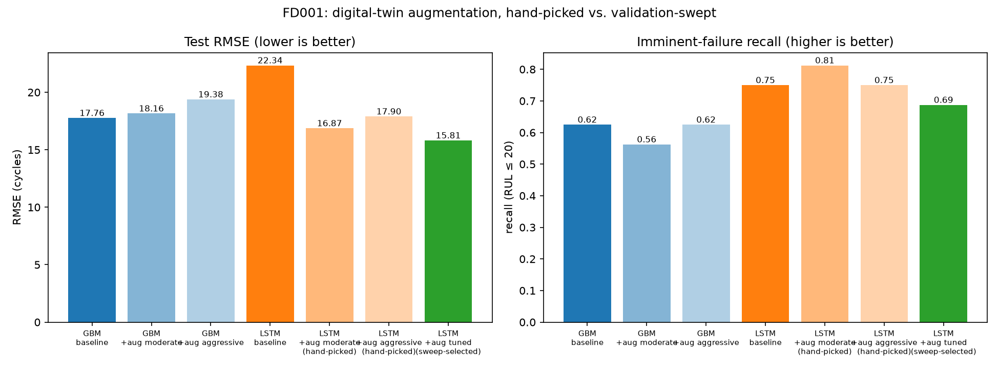
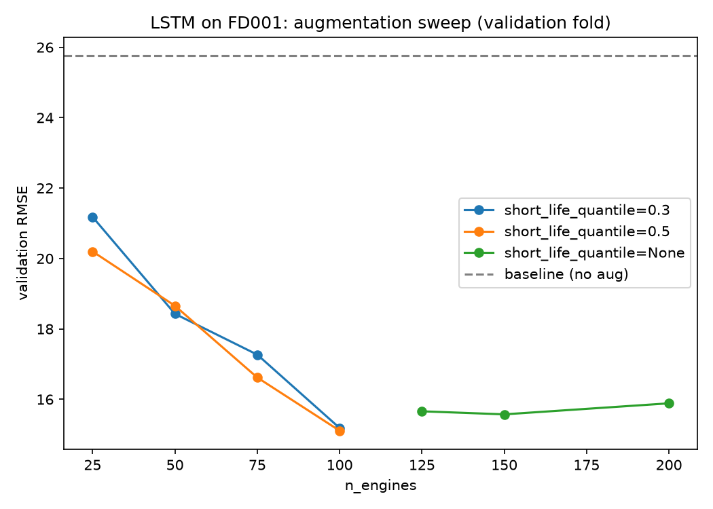
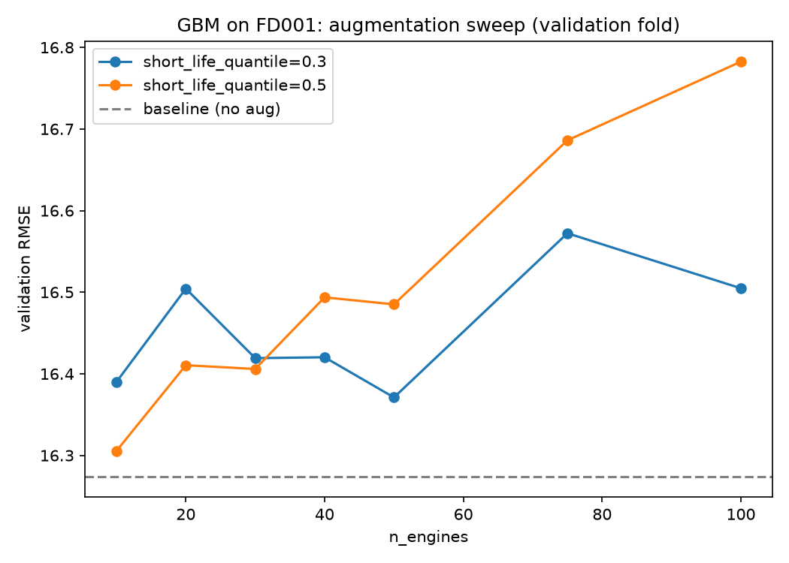
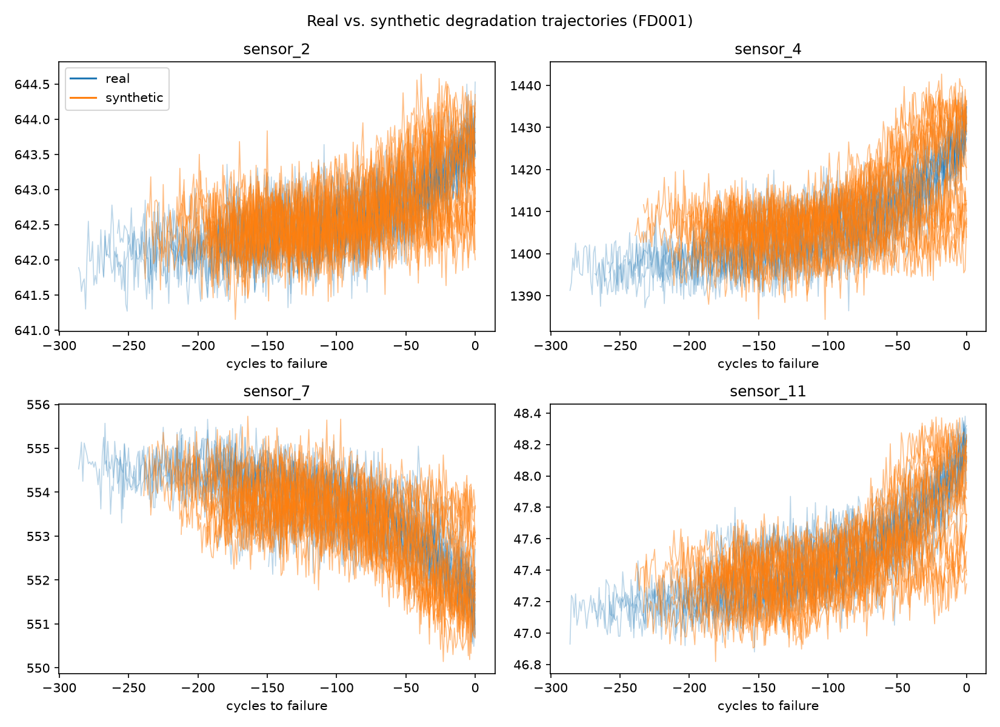

# Guardian

**A self-governing predictive-maintenance platform for jet engines.** Predicts remaining useful life from NASA C-MAPSS turbofan data, monitors its own accuracy, and when performance shifts, three local LLM agents debate whether it's real drift or noise before anything is retrained. Every decision is logged with its full transcript, and nothing leaves the machine.

   -black) 

## Architecture

Real turbofan data trains the baseline models. A digital-twin simulator, fitted from that same data, generates synthetic failures to address the rare-failure imbalance and to build test scenarios for the agents. Every batch of new data becomes an evidence packet that the agent layer reasons over. The agents never touch the model or the data directly; they only read the evidence and produce a decision.

```
NASA C-MAPSS (FD001 + FD004 real engine data)
      │
      ├──────────────► Digital-twin simulator (fitted from real data)
      ▼                        │ synthetic failures
GBM + LSTM baselines ◄─────────┘
(tracked in MLflow)
      │
      ▼
Evidence packet
(RMSE delta · sensor drift · decline-rate vs. the twin)
      │
      ▼
Monitor agent ── nothing unusual ──► done, no debate
      │ flagged
      ▼
Advocate FOR retrain   Advocate AGAINST retrain
(strongest honest case)  (strongest honest case)
      └────────┬────────┘
               ▼
          Judge agent
   ┌───────────┼─────────────┐
   ▼           ▼             ▼
approve      reject       escalate
retrain     no action    to a human
   │
   ▼
ml service: POST /retrain ──► real training run
      
Every step, including full transcripts ──► audit log (JSONL) ──► Streamlit dashboard
```

The agents run on a local Ollama model (`llama3.2:3b` by default). Three services run in Docker (`ml`, `agent`, `dashboard`); Ollama stays on the host. A GitHub Actions workflow runs the same pipeline weekly or on demand and only retrains if the Judge approves.

## Results

Simulator augmentation vs. baseline (test RMSE, FD001):



Validation sweep over augmentation intensity. The LSTM improves and then plateaus; the GBM never beats its no-augmentation baseline:

| LSTM | GBM |
|---|---|
|  |  |

Real vs. synthetic degradation trajectories from the simulator:



## What This Project Does

The ML platform:

- Trains a LightGBM regressor and an LSTM on NASA C-MAPSS **FD001** (1 operating condition) and **FD004** (6 conditions, 2 fault modes), scored with RMSE, MAE, the asymmetric PHM08 score, and precision/recall on the rare "imminent failure" class
- Documents the class imbalance (fewer than 1 in 10 cycles are near failure) in an executed EDA notebook
- Builds a physics-informed digital-twin simulator: a shared exponential degradation curve per sensor, a per-engine latent decline rate, manufacturing offsets, and calibrated noise
- Tracks every run locally in MLflow (SQLite, no server)

The agent layer, on top:

- Four separately-prompted roles (Monitor, Advocate-for, Advocate-against, Judge), each its own model call, no mega-prompt
- The Judge outputs `auto_approve_retrain`, `auto_reject`, or `escalate_to_human`. Escalating is a legitimate outcome, not a failure to decide
- Logs the full transcript of every decision, viewable in the dashboard
- Retrains only when the Judge approves, over a plain HTTP call between two containers
- Runs entirely on-machine, with no cloud LLM API calls anywhere, including in CI

## Quick Start

```bash
# 1. Set up
python3 -m venv .venv && source .venv/bin/activate
pip install -e ".[dev]"
python scripts/download_data.py                           # NASA C-MAPSS, ~12 MB

# 2. Train a baseline
python scripts/train.py --config configs/gbm_fd001.yaml

# 3. Run the agent pipeline (needs Ollama running)
ollama pull llama3.2:3b && ollama serve                   # in another terminal
python scripts/run_agent_pipeline.py --scenario all

# 4. Browse model health and every decision transcript
streamlit run src/guardian/dashboard/app.py
```

Or run the three services with Docker (Ollama stays on the host):

```bash
touch mlflow.db && mkdir -p logs checkpoints outputs && docker compose up --build
# ml :8001   agent :8002   dashboard :8501
```

A 10-minute walkthrough script is in [`DEMO.md`](DEMO.md).

## The Core Rule

Everything about the decision layer comes back to one rule: **a retrain must never happen silently, and the system must never force a confident call it isn't sure about.**

This is enforced in code, not just in prompts:

- The Monitor's job is only to decide whether evidence deserves a debate, so most batches are filtered out before any argument is made
- If the Monitor's JSON can't be parsed, the code flags the batch for review anyway
- If the Judge's JSON is unparseable or names an invalid decision, the code defaults to `escalate_to_human`, never to an auto-approve or auto-reject it can't verify
- The advocates are told not to invent evidence they weren't given, and to say so plainly if their case is weak
- Only an `auto_approve_retrain` verdict, with `auto_execute` on, ever triggers a real training run
- 35 unit tests cover the evidence logic, the fail-safe paths, and both API services, with the LLM stubbed so they're fast and deterministic

## What We Achieved

- Built and verified all five phases end to end: baselines, simulator, agents, containerized services + CI/CD, dashboard
- Cut LSTM test RMSE 29% (22.3 → 15.8) with a validation-selected augmentation config, enough to beat the GBM baseline outright
- Confirmed with a 21-config sweep that the same augmentation does **not** help the GBM at any setting tried, and reported that as-is
- Built three scenarios with known ground truth (`noise`, `genuine_drift`, `ambiguous`) from the simulator to test the debate mechanism
- Ran the whole stack in Docker, confirming the containerized agent reaches host Ollama and the containerized ML service reproduces the original Phase 1 metrics exactly
- Wrote a GitHub Actions workflow that installs Ollama on the runner and runs the real pipeline, with retraining gated on the Judge

## What Failed, and How We Fixed It

| # | What went wrong | How we fixed it |
|---|---|---|
| 1 | Training RUL clipping was also applied to the test labels, so the model was scored against a target it was never meant to predict | Kept clipping as a training-only step; evaluation uses NASA's true unclipped RUL |
| 2 | The LSTM collapsed to near-constant predictions on FD001 (RMSE 41.6, recall 0) because sensor inputs were never scaled | Z-score features using train statistics for every subset |
| 3 | Feature normalization was fit on train and validation combined, leaking validation engines into the scaling stats | Split first, fit the feature builder on the training fold only |
| 4 | LightGBM and PyTorch's MPS backend segfault when both are active in one process on macOS; MLflow's telemetry thread also raced with MPS | Import each model library lazily inside its own branch; disable MLflow telemetry |
| 5 | Synthetic trajectories looked visibly fuzzier than real ones because noise was estimated from curve-fit residuals that still contained curve misfit | Estimate noise from consecutive-cycle differences of the residual |
| 6 | Evidence RMSE was compared against a baseline computed on real data, so every simulator-drawn batch, including pure noise, looked like drift | Compute the baseline from fresh unperturbed simulator draws, with the same procedure as each batch |
| 7 | Comparing one random point per engine against a baseline over ~3,000 cycles made batch RMSE far noisier than the baseline | Evaluate every cycle of every engine, matching the baseline's method |
| 8 | The Monitor misread "faster than 56% of real engines" (a percentile, unremarkable) as "56% faster than normal" and flagged noise | Reworded the evidence with an explicit percentile and a plain-language verdict |
| 9 | The default PyPI `torch` wheel pulled several GB of unused CUDA libraries into the Docker image | Install the CPU-only build from PyTorch's own index first |
| 10 | A test's failing assertion exposed `/health` returning `test_rmse` instead of the intended `rmse` | Fixed the source, not the test |

## Case Study 1: RMSE looked better exactly when the data was drifting

While building the evidence layer, a batch with two sensors shifted about 4 standard deviations outside the calibrated range showed test **RMSE improving by 20%+** versus baseline, the opposite of what drift should do. Investigating showed it wasn't a fluke: across every rate and shift combination tried, the GBM's RMSE stayed flat or improved.

The cause is that tree models can't extrapolate past their training range. An input far outside anything seen in training collapses into whatever leaf sits at the edge of the tree, which can look stable, or even accidentally accurate, while the model has no real idea what it's looking at.

Guardian therefore doesn't trust RMSE alone. The evidence also includes signals that don't depend on the model's own predictions (live sensor drift and a digital-twin decline-rate comparison), and whenever sensor drift is large but RMSE looks fine, the evidence text carries an explicit caveat telling the agents to weigh the other signals more heavily.

## Case Study 2: the agent that punted, and why that's the right answer

On the `genuine_drift` scenario, the ground truth says retraining was warranted. The Monitor correctly flagged it and both advocates argued coherently from the evidence (one citing `sensor_11` at -4.5 SD, the other arguing the improved RMSE was likely noise). The Judge, a 3B-parameter local model facing one number that said "better" and others that said "worse", chose **`escalate_to_human` at low confidence** instead of a confident approve.

That isn't the clean auto-approve we hypothesized, and we reported it as-is rather than tuning the prompts until the "expected" label appeared. It's arguably the safe behavior, and the transcript shows exactly why the system landed there. It's also a real limit of a small model: even with an explicit caveat about the misleading RMSE, it hedged. A larger model may resolve this more decisively.

## What We Learned

- **A bad result is a clue, not just a score.** Several "surprising" numbers, an LSTM stuck at 41 RMSE, an "improving" RMSE under drift, turned out to be real bugs or real phenomena worth chasing.
- **Compare like with like.** A baseline computed by a different procedure or on a different data source looks exactly like drift. The baseline and the batch have to come from the same method.
- **Honest negative results are worth more than cherry-picked wins.** The augmentation helped one model and not the other; both findings are in the README and the notebooks.
- **Don't tune on a metric too small to trust.** Imminent-failure recall on this test set rests on 16 examples, so a config chosen to maximize validation recall scored identically to the RMSE-optimal one. RMSE drove selection instead.
- **Fail toward caution by construction.** Defaulting to "flag it" and "escalate it" in code costs nothing and removes a whole class of silent failures.
- **Small models need short, unambiguous evidence.** Wording that a person reads correctly can be misread by a 3B model.
- **Local-first is a constraint you can keep.** Even CI installs Ollama on the runner rather than reaching for a cloud LLM API.

## Project Structure

```
guardian/
├── DEMO.md                        # ~10-minute interview walkthrough
├── src/guardian/
│   ├── data/                      # loader, RUL labeling, features, regimes, splits
│   ├── models/                    # LightGBM and LSTM baselines
│   ├── simulator/                 # digital-twin degradation simulator
│   ├── agents/                    # evidence, prompts, debate, scenarios, audit log, Ollama client
│   ├── api/                       # ml_service.py and agent_service.py (FastAPI)
│   ├── dashboard/app.py           # Streamlit dashboard
│   └── eval/                      # metrics and plots
├── scripts/                       # download_data, train, sweep_augmentation,
│                                  #   generate_synthetic_data, run_agent_pipeline, ci_report_decision
├── configs/                       # one YAML per (model, subset, augmentation) experiment
├── notebooks/                     # 01 EDA · 02 simulator + augmentation · 03 agent debate
├── docs/images/                   # result charts used in this README
├── tests/                         # 35 unit tests
├── .github/workflows/             # monitor -> debate -> judge -> conditional retrain
├── Dockerfile
├── docker-compose.yml
└── pyproject.toml
```

## Reference

### Services (Docker Compose)

| Service | Port | Endpoint | Description |
|---|---|---|---|
| `ml` | 8001 | `GET /health` | Latest metrics per training run, read from MLflow |
| `ml` | 8001 | `POST /retrain` | Runs `scripts/train.py` for a named config |
| `agent` | 8002 | `POST /run` | Runs monitor → debate → judge on a named scenario; retrains only if the Judge approves and `auto_execute` is set |
| `agent` | 8002 | `GET /decisions` | The audit trail, most recent first |
| `dashboard` | 8501 | n/a | Model health and full decision transcripts |

### Metrics

Every training run logs RMSE, MAE, the PHM08 asymmetric score (which penalizes overestimating remaining life more than underestimating it), and precision/recall/F1 on the "imminent failure" class (RUL ≤ 20 cycles).

### Common commands

```bash
python scripts/sweep_augmentation.py --model gbm|lstm       # augmentation sweep on the validation fold
python scripts/train.py --config configs/lstm_fd001_aug_tuned.yaml
python scripts/run_agent_pipeline.py --scenario genuine_drift --model qwen2.5:7b-instruct-q5_K_M
mlflow ui --backend-store-uri sqlite:///mlflow.db
python -m pytest tests/ -v
```

## Tech Stack

| Layer | Technology |
|---|---|
| Data / models | Python, pandas, scikit-learn, LightGBM, PyTorch |
| Experiment tracking | MLflow (local SQLite) |
| Agents | Ollama (`llama3.2:3b`), plain sequential Python orchestration |
| Services | FastAPI, Uvicorn, httpx |
| Dashboard | Streamlit |
| Packaging / CI | Docker Compose, GitHub Actions |

## Licence

The dataset is the NASA C-MAPSS Turbofan Engine Degradation Simulation Data Set (Saxena et al., PHM08), a public NASA prognostics dataset. See [`data/DATA.md`](data/DATA.md) for provenance. The source code does not yet carry a licence file.
