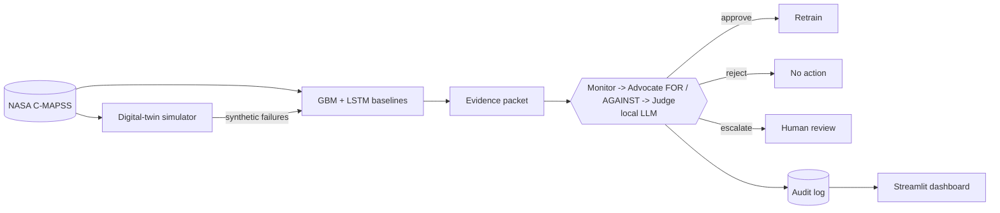

# Guardian

A predictive-maintenance system that governs itself. It predicts jet-engine
failures (NASA C-MAPSS), watches its own accuracy, and when performance
shifts, three local LLM agents debate whether it's real drift or noise before
anything is retrained. Everything runs on-machine via [Ollama](https://ollama.com), and
every decision is logged with its full transcript.

**Why:** no sensor data leaves the machine (data sovereignty), and no retrain
happens silently (auditability).

## How it works



The Judge picks `auto_approve_retrain`, `auto_reject`, or `escalate_to_human`.
Escalating is a valid outcome, and any unparseable model output defaults to
escalation, never to an auto-approve.

## Results

- **Class imbalance:** fewer than 1 in 10 cycles are near failure.
- **Simulator augmentation:** cut LSTM test RMSE 29% (22.3 → 15.8). It did not
  help the GBM at any setting tried.
- **Agents:** on a drift scenario the small local model escalated to a human
  rather than force a call. See `notebooks/03_agent_debate.ipynb`.

## Run it

```bash
python3 -m venv .venv && source .venv/bin/activate
pip install -e ".[dev]"
python scripts/download_data.py
python scripts/train.py --config configs/gbm_fd001.yaml     # baseline

ollama pull llama3.2:3b && ollama serve                      # in another terminal
python scripts/run_agent_pipeline.py --scenario all          # debate pipeline
streamlit run src/guardian/dashboard/app.py                  # audit dashboard
```

Or run the three services with Docker (Ollama stays on the host):
`touch mlflow.db && mkdir -p logs checkpoints outputs && docker compose up --build`

CI (`.github/workflows/guardian-pipeline.yml`) runs the real pipeline weekly or
on demand, and only retrains if the Judge approves.

Made 
